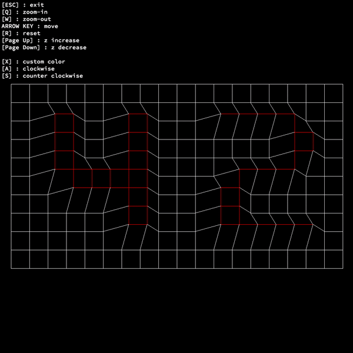

# FdF
  The basics of graphic programming, and in particular how to place points in space, how to join them with segments and how to observe the scene from a particular viewpoint.

#

#

## Usage
    ./fdf [map] [win_x] [win_y]

## Mandatory part
###### Create a simplified graphic "wireframe" represention of a relief landscape linking various points (x, y, z) via segments. The coordiantes of this landscape are stored in a file passed as a parameter to program.
  [x] Must have 2 type of project: parallel, iso, conic
  [x] Quit the program by pressing 'esc'
  [x] The use of images from minilibX is strongly encouraged
  [x] Find attached a binary called fdf as well as the example 42.fdf inside fdf.zip
  
## Bonus part
  [x] Fill the boxes with a color according to altitude
